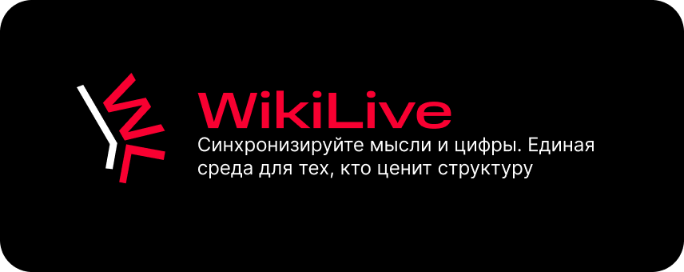
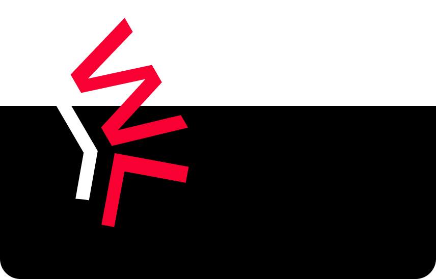

<div align="center">
  

  <br>

  
  
  

  <br><br>

  <p>
    WikiLive — система для совместного редактирования вики-документов<br>
    с поддержкой real-time синхронизации, версионирования и интеграции с таблицами.
  </p>

  <a href="./backend/openapi.yml">
    
  </a>
</div>

---

# 📌 Описание

**WikiLive** — backend-платформа для работы с вики-документами уровня Notion / Confluence.

Система реализует:
- хранение и управление страницами
- версионирование и черновики
- real-time совместную работу
- граф связей между документами
- интеграцию с внешними источниками (MWS Tables)

Backend выступает как **единый источник бизнес-логики (SSOT)** и отвечает за синхронизацию данных.

---

# 🛠 Технологический стек

- Java 21
- Spring Boot 3.2
- Spring Security (HTTP Basic Auth)
- Spring Data JPA (Hibernate)
- WebSocket (STOMP)
- PostgreSQL
- Docker / Docker Compose


# 🚀 Запуск проекта

Проект полностью контейнеризирован и запускается одной командой:

```bash
docker compose up --build
После запуска сервисы доступны:

Сервис	URL
Backend API	https://wiki-live.ru/api

WebSocket (YJS)	wss://wiki-live.ru/yjs
Adminer	http://<server-ip>:8080
```

| Сервис          | URL                                                  |
| --------------- | ---------------------------------------------------- |
| Backend API     | [https://wiki-live.ru/api](https://wiki-live.ru/api) |
| WebSocket (YJS) | wss://wiki-live.ru/yjs                               |
| Adminer         | http://<server-ip>:8080                              |

⚡ Production-ready: доступ через публичный домен без дополнительной настройки

---

## 🔷 Команда (таблица)

| 👤 Имя | 🔗 Ссылка | 🎯 Роль |
|:------:|:---------:|:-------:|
| Богдан | [](https://bogdahn-ishenko.github.io/resume/) |  |
| Владимир Андреев | [](https://github.com/vovandreevik) |  |
| Александр Локтев | [](https://github.com/StAlien666) |  |
| Илья Хакимов | [](https://github.com/PirateThunder) |  |
| Вадим Гамин | [](https://github.com/gaminv) |  |

<div align="center">



<br><br>

### WikiLive

Backend-платформа для живых документов и синхронизации данных (SSOT)

<br>

© 2026 ArksTech Team  
True Tech Hack 2026

</div>
